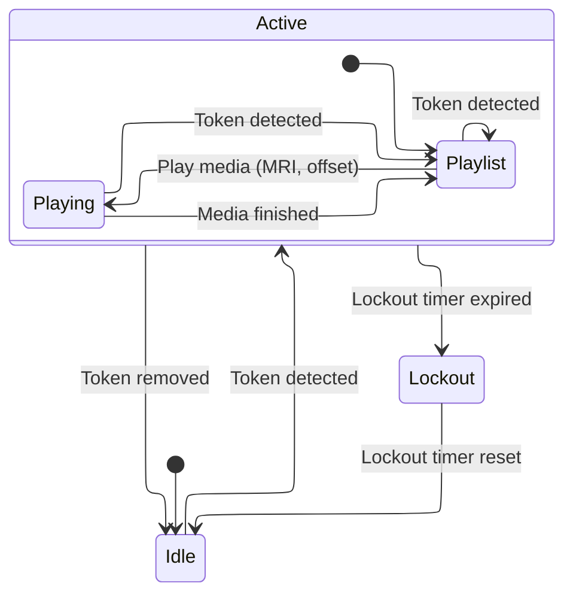

# State diagram

```mermaid
---
config:
  layout: elk
---
stateDiagram
  direction TB
  state Active {
    direction LR
    Playing --> Playlist:Token detected
    Playlist --> Playlist:Token detected
    Playlist --> Playing:Play media (MRI, offset)
    Playing --> Playlist:Media finished
    [*] --> Playlist
    Playing
    Playlist
[*]  }
  [*] --> Idle
  Idle --> Active:Token detected
  Lockout --> Idle:Lockout timer reset
  Active --> Lockout:Lockout timer expired
  Active --> Idle:Token removed

```